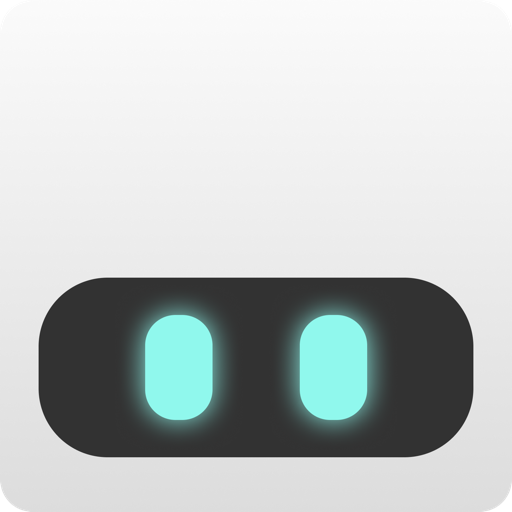

<p align="center">
  
</p>

<h1 align="center">Cali for Home Assistant</h1>

**Cali** is a voice-controlled desktop companion for macOS — a small animated
character with glowing neon eyes that lives at the top edge of your screen.
You talk to her, she talks back (Claude as the brain, ElevenLabs as the voice),
shows her mood through expressive eye glyphs, morphs into little icons when she
acts, and dances when your music plays.

This integration is Cali's Home Assistant counterpart. It lets her:

- **See and control your smart home** — but only what you explicitly expose
- **Act safely** — every action passes a server-side whitelist (locks and alarm
  panels are always read-only)
- **Stay up to date** — state changes of exposed entities are pushed to her live
- **Speak up** — use `cali.speak` in any automation to have her announce things
  ("The washing machine is done") with a matching facial expression

## Installation

**Via HACS (recommended):**

1. HACS → three-dot menu → *Custom repositories*
2. Add `https://github.com/Schooott/cali-ha` as type *Integration*
3. Install **Cali**, restart Home Assistant
4. Settings → Devices & Services → *Add Integration* → **Cali**

**Manually:** copy `custom_components/cali/` into `config/custom_components/cali/`
and restart.

## Authentication (for the Cali macOS app)

1. Create a dedicated Home Assistant user, e.g. **cali** (Settings → People →
   Users, *not* an administrator).
2. Log in as that user once → Profile → Security → create a
   **Long-lived access token**.
3. Enter the token and your HA URL(s) in Cali's settings on the Mac.

## Exposing entities

Two ways, freely combinable:

- Put the label **`cali`** on entities or whole devices (great for bulk)
- Pick individual entities in the integration's **options**

Everything else is invisible to Cali. Locks and alarm control panels are
**read-only** even when exposed — the action whitelist is enforced server-side
by this integration.

## Using Cali as a notification target

Pick the **"Cali: speak"** action (`cali.speak`) in any automation:

```yaml
action: cali.speak
data:
  message: "The washing machine is done."
  emotion: happy   # optional, one of the 12 below
  wake: true       # bring Cali out if she is hidden
```

Available emotions: `neutral`, `happy`, `wink`, `love`, `surprised`, `crazy`,
`sceptic`, `tired`, `sad`, `denying`, `angry`, `broken`.

## WebSocket API (used by the Cali app)

- `cali/entities` — exposed entities, compact (name, area, state, allowed actions)
- `cali/action` — `{entity_id, action, params?}`, whitelisted server-side
- `cali/subscribe` — pushes `notify` events (from `cali.speak`), `state` updates
  of exposed entities, and `entities_changed` when the exposure set changes
